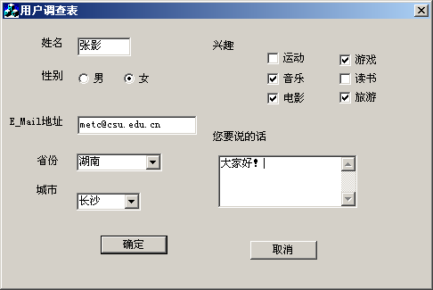
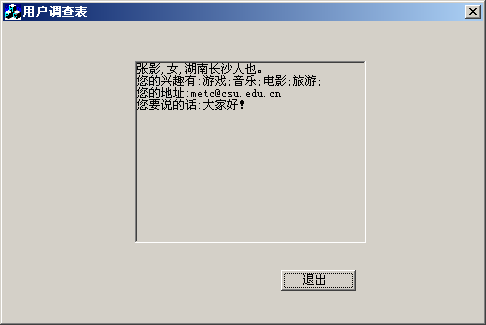

# MFC-exercises

Some exercises in the realm of MFC frameworks.

## Exercise 1: Mouse and Keyboard
Please craft a multi-document program with the following specifications:

1. Continuously exhibit the positional status of the mouse within the client area. If a click occurs, present a dialog box informing the user of the pressed mouse button.
2. When the user presses the SHIFT or CTRL key, present a dialog box indicating which key has been pressed.

## Exercise 2: Utilizing CDC in the CView Class

Employ MFC (single-document) to automatically render a sine curve. Specifications include: the sine curve is black with a width of 2, and the coordinate system is red with a width of 1.

## Exercise 3: MFC Standard Controls

Devise a user survey form as depicted in the image:

Upon the user's selection of the "OK" button, employ a static text control to exhibit all the user's information, akin to the illustration below:

## Exercise 4: MFC Resource Class

Construct a single-document application encompassing a menu, toolbar, and status bar. Requirements are as follows:

1. Within the main menu bar, introduce a menu item titled "My Menu" with two sub-options: "Color" and "Font." Upon user selection, prompt color and font dialogs to modify the appearance of the displayed "Hello World" text in the document.
2. Add buttons to the toolbar, ensuring their functionalities mirror those of the corresponding menu items.
3. Append two information bars in the status bar to display the mouse's x and y coordinates. As the mouse moves, the pointer's coordinates in the status bar should dynamically update.

## Exercise 5: Commonly Used Classes in MFC

Develop a straightforward clock application.

## Exercise 6: Utilization of MFC Controls

Conceive a calculator with the following functionalities: addition, subtraction, multiplication, division, square root, reciprocal, and modulus. Display the input data, intermediate results, and final outcome in a singular label at the top of the window.

Ensure that "0" cannot serve as a divisor. The "Backspace" button should erase the last input, while the "Clear" button should reset all entered data.

## Exercise 7: MFC Database Application

Establish an SDI application supporting ODBC or ADO for a database. Implement the following features:

1. Retrieve records from the "studentmarks.mdb" (student grades table) table, enabling navigation through the records (previous, next, last, first).
2. Empower users to add, modify, and delete records.
3. Implement sorting based on grades.
4. Enable searching for all grades of a student by their name.

## Exercise 8: MFC Network Programming

Construct a straightforward network chat application facilitating communication between a client and a server.

# MFC练习

一些在MFC框架领域的练习。

## 练习1：鼠标和键盘
请编写一个满足以下规格的多文档程序：

1. 持续显示鼠标在客户区域内的位置状态。如果发生点击事件，请弹出对话框通知用户按下的鼠标按钮。
2. 当用户按下SHIFT或CTRL键时，显示一个对话框指示已按下的键是哪个键。

## 练习2：在CView类中使用CDC

利用MFC（单文档）自动绘制正弦曲线。要求：正弦曲线为黑色，宽度为2，坐标系为红色，宽度为1。

## 练习3：MFC标准控件

设计一个用户调查表单，如下图所示：

在用户选择“确定”按钮后，使用静态文本控件展示用户的所有信息，类似于下面的示例：

## 练习4：MFC资源类

构建一个包含菜单、工具栏和状态栏的单文档应用程序。要求如下：

1. 在主菜单栏中，引入一个名为“My Menu”的菜单项，其中包含两个子选项：“Color”和“Font”。用户选择后，弹出颜色和字体对话框以修改文档中显示的“Hello World”文本的外观。
2. 在工具栏上添加按钮，确保它们的功能与相应的菜单项相匹配。
3. 在状态栏中追加两个信息栏，用于显示鼠标的x和y坐标。随着鼠标移动，状态栏中的指针坐标应动态更新。

## 练习5：MFC中常用的类

开发一个简单的时钟应用程序。

## 练习6：使用MFC控件

构想一个具有以下功能的计算器：加法、减法、乘法、除法、平方根、倒数和模。在窗口顶部的单个标签中显示输入数据、中间结果和最终结果。

确保“0”不能作为被除数。单击“退格”按钮应删除上次输入，而单击“清除”按钮应重置所有输入的数据。

## 练习7：MFC数据库应用程序

建立一个支持ODBC或ADO的SDI应用程序，用于处理数据库。实现以下功能：

1. 从“studentmarks.mdb”（学生成绩表）表中检索记录，支持通过记录进行导航（上一个、下一个、最后一个、第一个）。
2. 允许用户添加、修改和删除记录。
3. 实现基于成绩的排序。
4. 允许按学生姓名搜索所有成绩。

## 练习8：MFC网络编程

构建一个简单的网络聊天应用程序，促进客户端和服务器之间的通信。
